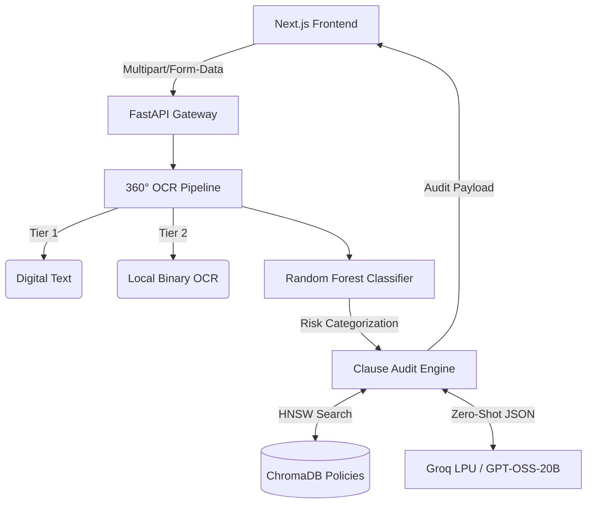

# ClauseGuard | Contract Risk Engine


**ClauseGuard** is an AI powered legal tender and contract risk auditing platform. Engineered for public procurement and commercial agreements, the system utilizes a fault tolerant 3-tier OCR pipeline, Classical Machine Learning, and Retrieval Augmented Generation (RAG) to autonomously detect liabilities, statutory violations, and draft secure counter proposals in seconds.

## 🏗 System Architecture



## ◈ Core Architecture

* **Deterministic Fallback Extraction:** Extracts structured data directly from raw PDFs via `PyMuPDF`, gracefully falling back to OS level `Tesseract OCR` to mitigate LLM transcription hallucinations.
* **Asynchronous Inference Pipeline:** Orchestrates non blocking RAG workloads against Groq LPUs, enforcing strict JSON schema parsing for statutory violation detection and redlined counter-proposals.
* **Executive-Grade Interface:** React powered UI featuring cursor reactive gradient tracking, staggered micro-interactions via Framer Motion, and a refined editorial typographic system.

---

## ⬡ Backend Deployment ⬡ Backend Deployment(Docker)

The service is fully containerized, packaging required C++ graphics runtimes and Tesseract binary dependencies for headless cloud environments.

```bash
# Build the production image
docker build -t clauseguard-core .

# Run containerized service
docker run -p 8000:8000 --env-file .env clauseguard-core
```